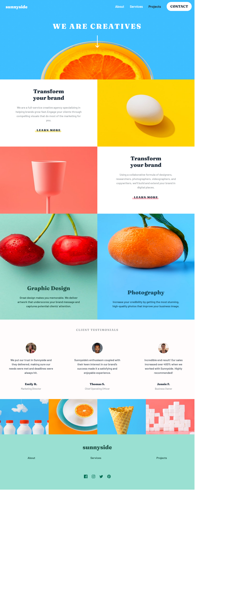

# Frontend Mentor - Sunnyside agency landing page solution

This is a solution to the [Sunnyside agency landing page challenge on Frontend Mentor](https://www.frontendmentor.io/challenges/sunnyside-agency-landing-page-7yVs3B6ef). Frontend Mentor challenges help you improve your coding skills by building realistic projects.

## Table of contents

- [Overview](#overview)
  - [The challenge](#the-challenge)
  - [Screenshot](#screenshot)
  - [Links](#links)
- [My process](#my-process)
  - [Built with](#built-with)
  - [What I learned](#what-i-learned)
  - [Continued development](#continued-development)
- [Author](#author)
- [Acknowledgments](#acknowledgments)

## Overview

### The challenge

Users should be able to:

- View the optimal layout for the site depending on their device's screen size
- See hover states for all interactive elements on the page

### Screenshot

### Links

- [Solution](https://your-solution-url.com)
- [Live](https://github.com/ikennarichard/sunnyside-agency-landing-page/settings/pages)

## My process

### Built with

- Semantic HTML5 markup
- CSS custom properties
- Flexbox
- CSS Grid
- Mobile-first workflow
- [SaSS](https://sass-lang.com)
- [BootStrap](https://getbootstrap.com)

### What I learned
I learn't some of the basic features of css frameworks SaSS and Bootstrap.

### Continued development
I will keep pratcing and learning the core features of these frameworks, to understand it usefulness on different area of the development process.

## Author

- Website - [ikennarichard](https://ikennarichard.netlify.app)
- Frontend Mentor - [@ikennarichard](https://www.frontendmentor.io/profile/ikennarichard)
- Twitter - [@ikennarichard_](https://www.twitter.com/ikennarichard_)

## Acknowledgments

My deepest appreciation goes to all my friends at Frontend Mentor, you guys are awesome 😺.